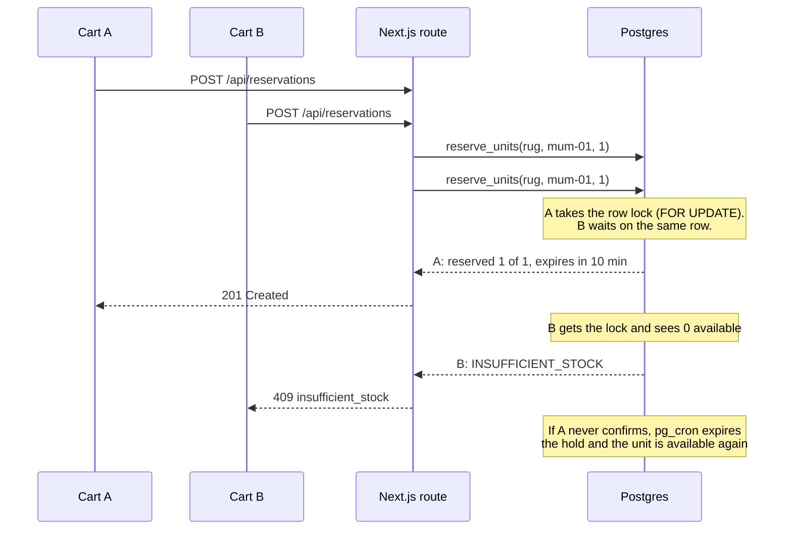

# Allo

A storefront where "Reserve" holds stock for 10 minutes while you pay, and two carts can never get the same last unit.

**Live demo:** [allo.abhashchakraborty.tech](https://allo.abhashchakraborty.tech) · [Engineering walkthrough](https://allo.abhashchakraborty.tech/guide)


## The idea

When a customer clicks Reserve, Allo puts a timed hold on the units instead of selling them. The customer then confirms (the stock leaves the warehouse), cancels (the units go back on the shelf), or does nothing and the hold expires on its own.

The hard part is the last unit. If two people press Reserve at the same moment, a check like "is there stock? then reserve it" in application code lets both through. Allo makes that decision inside Postgres instead, where it can't be raced.

### How it stays correct

**Row locks.** Each `(product, warehouse)` pair is one row in `inventory`, with `total_units` and `reserved_units`. `reserve_units()` is a PL/pgSQL function that runs in a single transaction:

```sql
select * from inventory
 where product_id = $1 and warehouse_id = $2
 for update;                 -- the second caller waits here

-- available = total_units - reserved_units; raise INSUFFICIENT_STOCK if too few
update inventory set reserved_units = reserved_units + $qty ...;
insert into reservations (..., status, expires_at) values (..., 'pending', now() + ttl);
```

The first request takes the lock, reserves and commits. Everyone else queued on that row wakes up, sees the new count and gets `409 insufficient_stock`. A `CHECK (reserved_units <= total_units)` constraint backs this up, so even a bug elsewhere can't oversell.

**Idempotency keys.** Networks drop responses, and people double-click. `POST /api/reservations` and `POST /api/reservations/:id/confirm` accept an `Idempotency-Key` header:

- The first request claims the key with an `INSERT ... ON CONFLICT DO NOTHING` (only one of N concurrent claims can win), runs, and stores its response.
- A retry with the same key and body gets the stored response back, with `Idempotent-Replay: true`. Nothing runs twice.
- The same key with a different body gets `409 idempotency_conflict`.
- A retry that arrives while the first is still running waits up to 5 s, then gets `425 idempotency_in_progress`.

**Expiry.** A hold that's never confirmed must give its units back. Three layers make sure it does:

1. **pg_cron** runs `expire_reservations()` inside Postgres every minute (`supabase/migrations/0004_cron.sql`). It uses `FOR UPDATE SKIP LOCKED`, so two overlapping sweeps never block each other.
2. **On read:** `GET /api/reservations/:id` expires a stale hold before answering, so nobody ever sees "pending" after the timer ran out.
3. **On confirm:** `confirm_reservation()` checks `expires_at` inside the same lock that takes the stock. A payment that arrives one second late can't beat the timer.



### Proof

`scripts/race.mjs` fires 50 reserve requests at once for the single wool rug stocked in Mumbai, counts the answers, then releases the winning hold. Against the live demo:

```
$ node scripts/race.mjs https://allo.abhashchakraborty.tech 50
50 carts → Hand-knotted Wool Rug 6×9 @ mum-01 (1 available)
  201 created              × 1
  409 insufficient_stock   × 49
  all 50 answered in 2329 ms
released 1 hold(s); 1 unit(s) available again
```

Three runs in a row gave the same split: one hold, 49 refusals.

The checkout page shows the countdown and listens for changes to its reservation over Supabase Realtime, with a 5-second poll as a fallback. When the timer runs out it flips to Expired on its own:


## Stack

- Next.js 16 (App Router, React 19), TypeScript, Tailwind CSS 4
- Supabase Postgres with PL/pgSQL functions and no ORM, pg_cron, Realtime
- Zod for request validation
- Vercel for hosting

## API

| Method | Path | What it does |
| --- | --- | --- |
| GET | `/api/products` | Every product with stock per warehouse |
| GET | `/api/warehouses` | The four warehouses |
| POST | `/api/reservations` | Place a hold (`Idempotency-Key` supported) |
| GET | `/api/reservations/:id` | Reservation status, expiring it first if its time is up |
| POST | `/api/reservations/:id/confirm` | Buy: the units leave the warehouse (`Idempotency-Key` supported) |
| POST | `/api/reservations/:id/release` | Cancel: the units go back |
| GET, POST | `/api/cron/expire-reservations` | Run the expiry sweep now (`Authorization: Bearer $CRON_SECRET`) |

Every route sends `Cache-Control: no-store`. Errors look like `{ "error": { "code", "message" } }`.

## Run it locally

You need Node 20+, pnpm and Docker (for the local Supabase stack). The Supabase CLI comes with the dev dependencies.

```bash
pnpm install
pnpm exec supabase start      # Postgres, Realtime and the API in Docker; applies
                              # supabase/migrations and the seed in supabase/seed
pnpm exec supabase status     # prints the API URL, anon key and service_role key
cp .env.example .env.local    # paste those three values in
pnpm dev                      # http://localhost:3000
```

`pnpm exec supabase db reset` rebuilds the database from the migrations and seed at any time. The seed has 106 products across 4 warehouses, and `ALO-RUG-01` has exactly one unit in Mumbai, so `node scripts/race.mjs` works out of the box.

### Environment variables

| Name | Required | Used for |
| --- | --- | --- |
| `NEXT_PUBLIC_SUPABASE_URL` | yes | Supabase API URL |
| `NEXT_PUBLIC_SUPABASE_ANON_KEY` | yes | Browser client, Realtime only (read access) |
| `SUPABASE_SERVICE_ROLE_KEY` | yes | Server-side calls to the stored functions; never sent to the browser |
| `CRON_SECRET` | no | Protects the manual expiry route; without it the route answers 503 |
| `RESERVATION_TTL_SECONDS` | no | Hold length, default `600` |

## Deploying

1. Create a Supabase project, then link it and push the schema and seed:
   ```bash
   pnpm exec supabase link --project-ref <your-project-ref>
   pnpm exec supabase db push --include-seed
   ```
   This also schedules the pg_cron job, so expiry runs without any outside scheduler.
2. Import the repo into Vercel and set the environment variables above.

The Vercel free plan only allows a daily cron, which is far too slow for a 10-minute hold. That's why the sweep runs in pg_cron and the HTTP route is only a manual fallback.

## Project layout

```
src/app/                    pages and API routes (products, reservations, docs, guide)
src/components/             header, product grid, reserve modal, checkout view, ASCII video hero
src/lib/idempotency.ts      the Idempotency-Key protocol
src/lib/api-error.ts        maps Postgres errors to HTTP status codes
supabase/migrations/        schema, stored functions, Realtime, pg_cron, RLS
supabase/seed/              catalogue, stock and product images, applied in file order
scripts/race.mjs            the 50-cart race test
```

## Trade-offs

- **No accounts.** A reservation ID is a random UUID, which is enough for a demo. A real store would tie holds to a signed-in customer.
- **Public read access.** Row-level security is on for every table. The anon key can only read products, stock and reservations (Realtime needs that); all writes go through the server and the stored functions, and `idempotency_keys` isn't readable at all.
- **No automated test suite.** `scripts/race.mjs` checks the core guarantee against any running instance; a database-level concurrency test and Playwright flows would come next.
- **Idempotency keys are never pruned.** Production would delete rows older than a day, using the existing `created_at` index.

## Licence

[MIT](LICENSE) © 2026 Abhash Chakraborty
